<!-- Generated from README.md by scripts/build_light_readme.py. Do not edit by hand. -->

<div align="center">

<picture>
  <source media="(prefers-color-scheme: dark)" srcset="./docs/assets/adk_dev_logo_light.png">
  
</picture>

# ShopFlow

**A distributed order processing and notification system on a 3-node RabbitMQ quorum cluster. Twenty-four containers publish, route and consume real orders, and a chaos panel lets you kill any of them and watch the cluster carry on.**


<br>


<br><br>

[](https://github.com/Dileepadari/shopflow/actions/workflows/ci.yml)

**[Developer documentation](./DEVDOC.md)** &middot; [Screenshots](#the-dashboard) &middot; [Quick start](#quick-start) &middot; [Chaos](#breaking-things-on-purpose)

<p><b>Light mode</b> &middot; <a href="./README.md">View this page in dark mode</a></p>

</div>

---

## Contents

- [What ShopFlow is](#what-shopflow-is)
- [Quick start](#quick-start)
- [Where everything lives](#where-everything-lives)
- [Place your first order](#place-your-first-order)
- [The dashboard](#the-dashboard)
- [Breaking things on purpose](#breaking-things-on-purpose)
- [Tuning](#tuning)
- [Checking the system is healthy](#checking-the-system-is-healthy)
- [Load testing](#load-testing)
- [Troubleshooting](#troubleshooting)
- [Shutting down](#shutting-down)
- [For developers](#for-developers)
- [Credits](#credits)

---

## What ShopFlow is

When you buy something online, a dozen things have to happen: the payment is
charged, stock is reserved, you get an email and an SMS, the event is logged, and
somewhere a regional system takes over for tax and compliance.

The naive way to build that is to have the order service call each of those in
turn over HTTP. Then the payment gateway gets slow, the order service's threads
all pile up waiting for it, and checkout stops working for everyone.

ShopFlow builds it the other way round. Every service publishes messages to
RabbitMQ and every other service subscribes to what it cares about. Nothing waits
on anything. If a service crashes mid-work, its unfinished message goes back on
the queue and another copy picks it up. If a broker node dies, the other two
carry on.

**What is actually running:**

| | |
|---|---|
| **3-node RabbitMQ cluster** | Quorum queues replicated across all three nodes, so a write survives losing one |
| **HAProxy** | One AMQP address for everything; reroutes automatically when a node goes down |
| **16 consumer services** | Payment ×2, inventory ×2, email, SMS, push, two log sinks, three notification handlers, three regional processors, and the dead letter auditor |
| **Producer API** | REST endpoints for placing orders, so you never have to run a script by hand |
| **Chaos Control Panel** | Stop, kill, pause and flood things on demand |
| **React dashboard** | Live view of queues, exchanges, consumers, throughput and failures |

All five RabbitMQ exchange types are exercised by a single order - direct,
fanout, topic, headers and the default exchange - plus a dead letter exchange for
anything that fails.

---

## Quick start

**You need:** Docker Desktop, or Docker Engine with the Compose plugin. Nothing
else - no Python, no Node, no local RabbitMQ.

```bash
git clone https://github.com/Dileepadari/shopflow.git
cd shopflow
cp .env.example .env          # optional; sensible defaults are built in
docker compose up --build -d
```

The first build takes a few minutes while images download. Then open:

### **http://localhost:3000**

Give it about a minute to settle - the cluster forms, `cluster_init` declares the
topology, and only then do the consumers start. To watch that happen:

```bash
docker compose logs -f cluster_init
```

Once `docker compose ps` shows everything up and `cluster_init` has exited with
code 0, you are ready.

---

## Where everything lives

| What | URL | Login |
|---|---|---|
| **Dashboard** | http://localhost:3000 | - |
| Producer API docs | http://localhost:8090/docs | - |
| Chaos Panel API docs | http://localhost:8080/docs | - |
| RabbitMQ management (node 1) | http://localhost:15672 | `admin` / `shopflow123` |
| RabbitMQ management (node 2) | http://localhost:15673 | `admin` / `shopflow123` |
| RabbitMQ management (node 3) | http://localhost:15674 | `admin` / `shopflow123` |
| HAProxy stats | http://localhost:8404/stats | `admin` / `shopflow123` |
| AMQP (via HAProxy) | `localhost:5670` | `admin` / `shopflow123` |

> **About those credentials.** They are demonstration defaults, committed on
> purpose so the project runs with no setup. They are not secrets. If you put
> this anywhere reachable by other people, change `RABBITMQ_PASS` and
> `RABBITMQ_ERLANG_COOKIE` in your `.env` first.

---

## Place your first order

**From the dashboard** - open the **Orders** tab, pick a region, press Send.

**From the command line:**

```bash
curl -X POST http://localhost:8090/orders/publish \
  -H 'Content-Type: application/json' \
  -d '{"region":"US","format":"json","amount":149.99}'
```

```json
{ "status": "published", "order_id": "3f2a8c14-..." }
```

That single call produced about a dozen messages. Watch them land on the
**Queues** tab, or follow one consumer:

```bash
docker compose logs -f payment_consumer_1
```

**A batch, over one connection:**

```bash
curl -X POST http://localhost:8090/orders/batch \
  -H 'Content-Type: application/json' \
  -d '{"count":50,"region":"EU","format":"json"}'
```

### What one order actually does

```
                        POST /orders/publish
                                 │
        ┌────────────────────────┼────────────────────────┐
        │                        │                        │
  default exchange         order.events           notifications.topic
   (work queues)             (fanout)                   (topic)
        │                        │                        │
  payment_queue  ──┐        email_queue      notification.email.*   -> notif_email_queue
  inventory_queue  │        sms_queue        notification.sms.urgent -> notif_sms_queue
        │          │        push_queue       #                      -> notif_audit_queue
        │          │             │                        │
  2 workers each   │       3 consumers,             3 consumers
  compete for      │       each gets a copy
  each message     │
                   │
        ┌──────────┴──────────┐
  logs.info / logs.error   orders.headers
       (direct)               (headers)
        │                        │
  log_info_queue          region=EU + format=json -> eu_queue
  log_error_queue         region=US + format=json -> us_queue
                          format=xml             -> xml_legacy_queue

  Anything that fails 3 times, or sits unconsumed for 60 seconds, is routed to
  dead.letter.exchange -> dead_letter_queue -> the DLX Audit tab.
```

---

## The dashboard

Nine tabs, refreshing every two seconds. There is a light/dark toggle at the top
right.

| Tab | What it shows |
|---|---|
| **Overview** | Cluster-wide totals, live publish/deliver/ack rates, and current queue depths |
| **Queues** | Every queue: backlog, in-flight messages, consumer count, queue type |
| **Exchanges** | Each exchange and exactly what is bound to it, with routing keys and header rules |
| **Consumers** | Live subscriptions, prefetch settings, and which container each belongs to |
| **Connections** | Open AMQP connections grouped by the cluster node serving them |
| **DLX Audit** | Every message that failed permanently - source queue, reason, retry count, full body |
| **Orders** | Place single orders or batches |
| **Publisher** | Publish a raw message to any exchange, with ready-made samples per exchange type |
| **Chaos** | Break things (see below) |

Every image is a real 1440x900 viewport render against the full 24-container stack under a sustained load of 300 orders every four seconds, so the charts and queue depths are real traffic rather than an idle system. This page shows **dark mode**; the same gallery in light mode is at **[README-light.md](./README-light.md)**.

<table>
  <tr>
    <td width="33%" valign="top">
      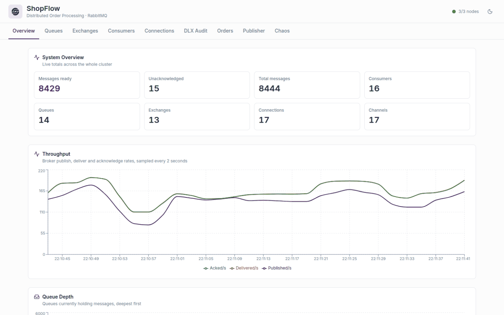
      <p align="center"><b>Overview</b><br><sub>Cluster totals and live publish, deliver and ack rates.</sub></p>
    </td>
    <td width="33%" valign="top">
      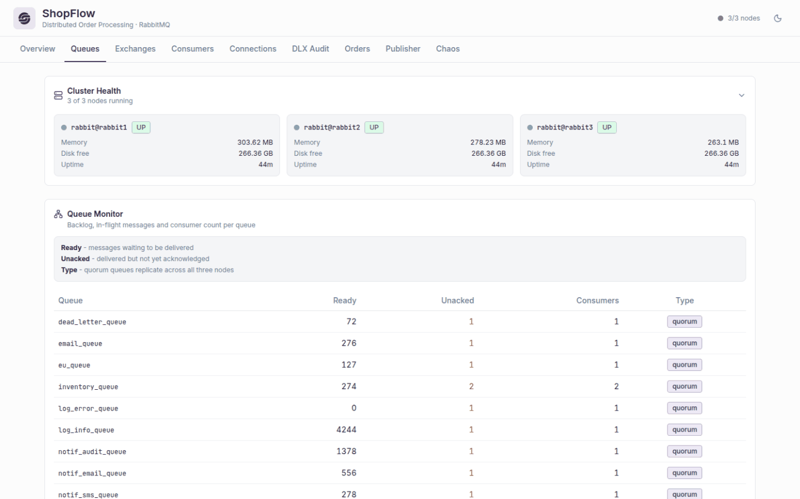
      <p align="center"><b>Queues</b><br><sub>Backlog, in-flight and consumers for all fourteen quorum queues.</sub></p>
    </td>
    <td width="33%" valign="top">
      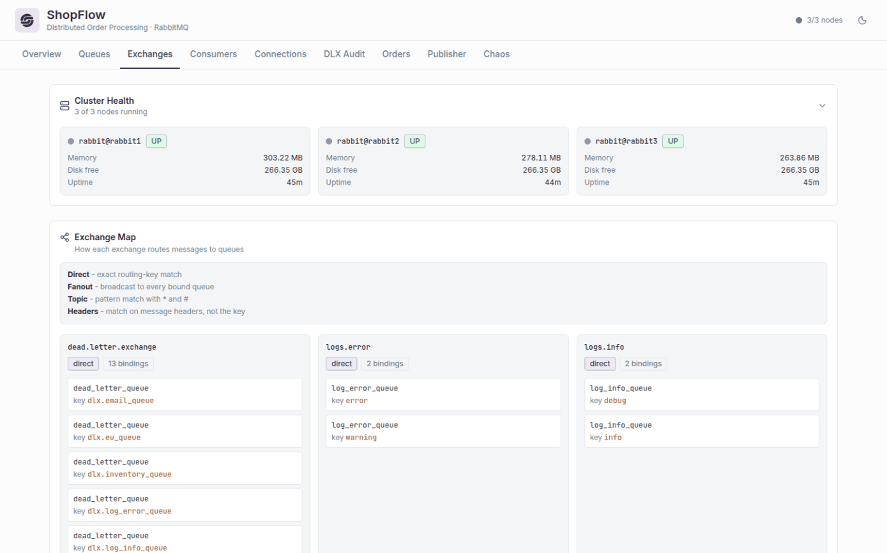
      <p align="center"><b>Exchanges</b><br><sub>What is bound to each exchange, and the key or header that binds it.</sub></p>
    </td>
  </tr>
  <tr>
    <td width="33%" valign="top">
      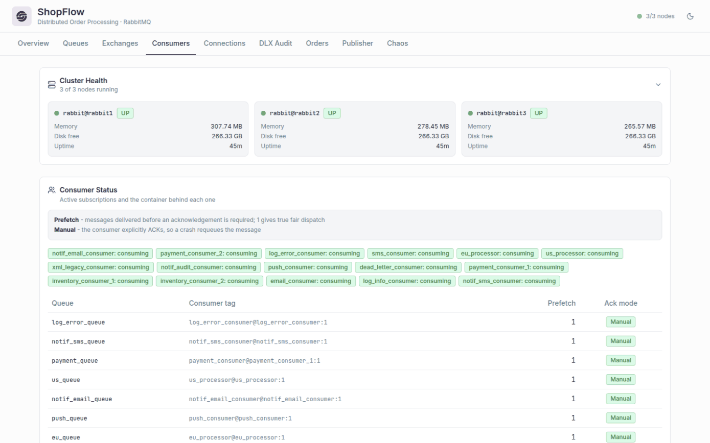
      <p align="center"><b>Consumers</b><br><sub>Live subscriptions, prefetch, ack mode, and the container behind each.</sub></p>
    </td>
    <td width="33%" valign="top">
      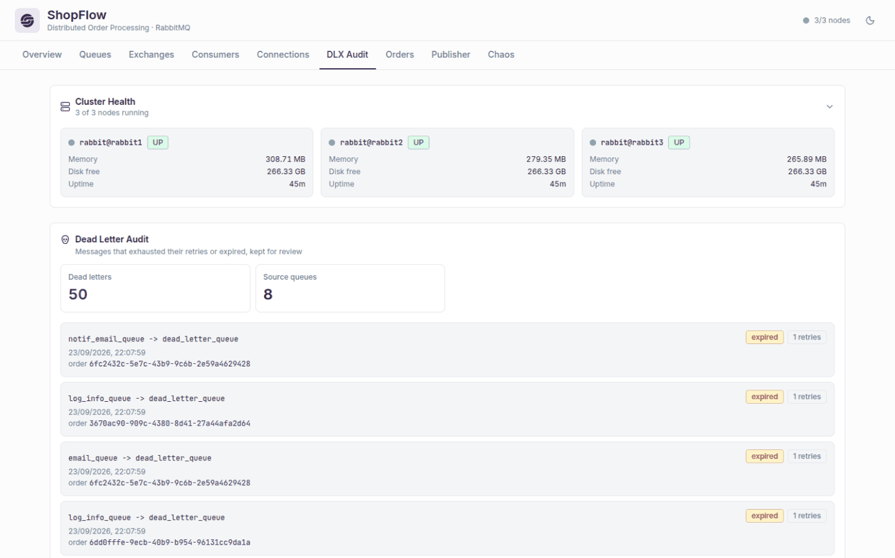
      <p align="center"><b>DLX Audit</b><br><sub>Everything that failed for good: source queue, reason, retry count.</sub></p>
    </td>
    <td width="33%" valign="top">
      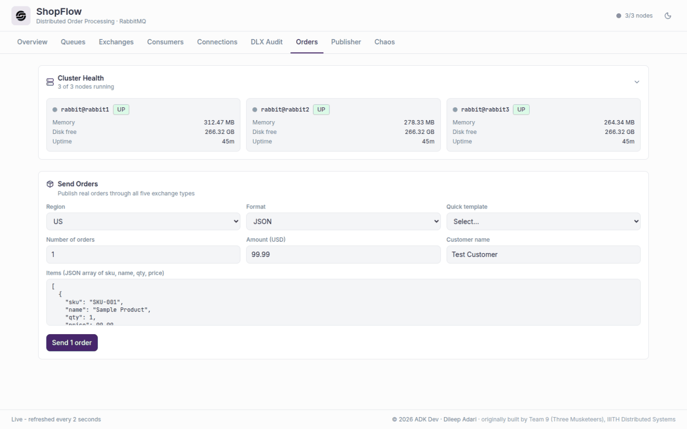
      <p align="center"><b>Orders</b><br><sub>Place one order or a batch, in JSON or XML, to either region.</sub></p>
    </td>
  </tr>
  <tr>
    <td width="33%" valign="top">
      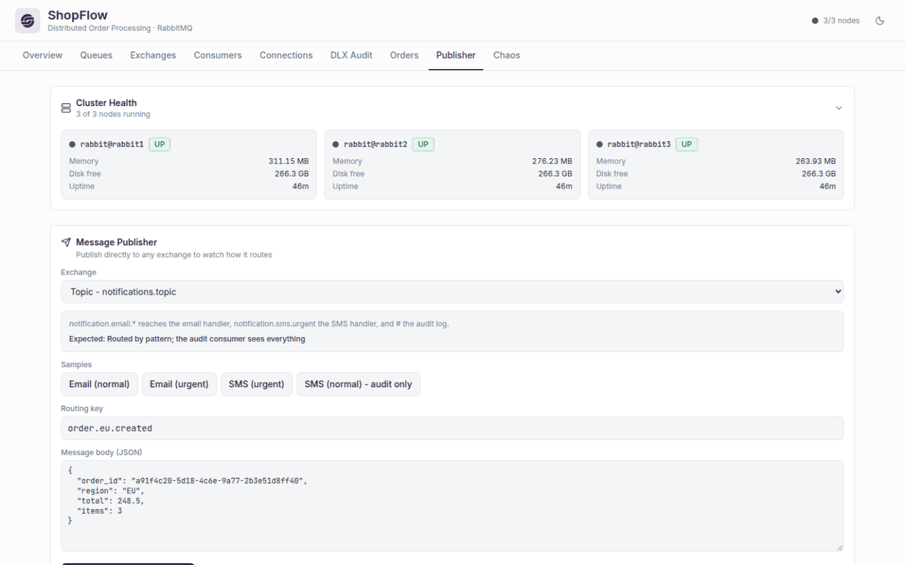
      <p align="center"><b>Publisher</b><br><sub>Publish to any exchange, with samples that demonstrate its routing.</sub></p>
    </td>
    <td width="33%" valign="top">
      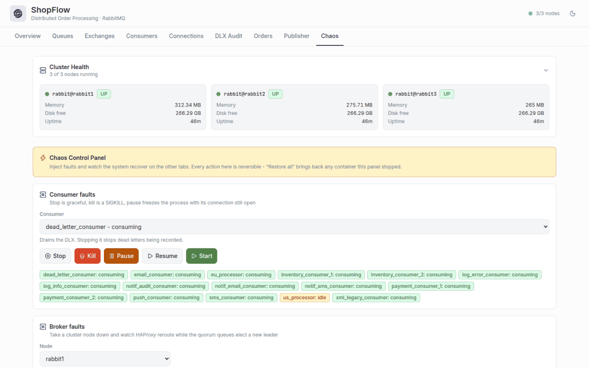
      <p align="center"><b>Chaos</b><br><sub>Stop, kill or pause a consumer, or take a broker node down. All reversible.</sub></p>
    </td>
    <td width="33%"></td>
  </tr>
</table>

### Responsive layout

The queue table drops its Unacked and Type columns below 640px, and the tab bar scrolls
horizontally rather than wrapping.

<table>
  <tr>
    <td width="25%" valign="top">
      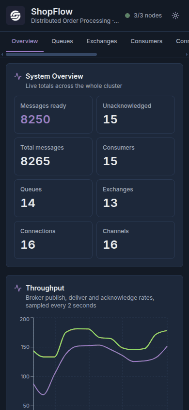
      <p align="center"><sub><b>Overview</b><br>390 x 844</sub></p>
    </td>
    <td width="25%" valign="top">
      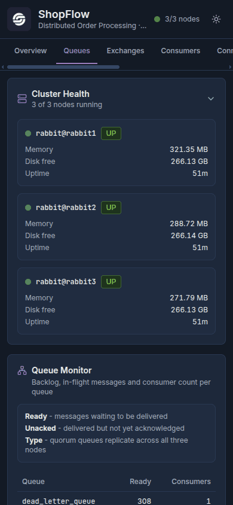
      <p align="center"><sub><b>Queues</b><br>390 x 844</sub></p>
    </td>
    <td width="50%" valign="top">
      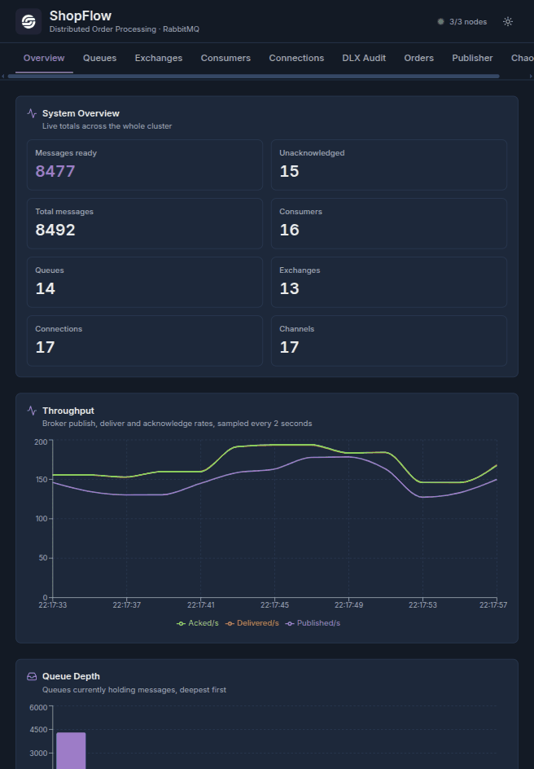
      <p align="center"><sub><b>Overview</b><br>820 x 1180</sub></p>
    </td>
  </tr>
</table>

---

## Breaking things on purpose

This is the interesting part. Open the **Chaos** tab, keep **Queues** open in a
second window, and try these.

### Stop a consumer and watch the backlog build

Stop `payment_consumer_1`, then publish 20 orders. `payment_queue` starts filling
up because only one worker is left. Start it again and the backlog drains.

### Kill a consumer mid-message

Kill `email_consumer` with SIGKILL while it is working. The message it had not
finished was never acknowledged, so RabbitMQ requeues it the moment the TCP
connection drops. Nothing is lost.

### Poison a queue

Inject messages that cannot be parsed. Each one fails, is retried up to three
times, and then lands in the **DLX Audit** tab with its full history. The
consumer stays healthy throughout.

### Take a broker node down

Stop `rabbit2`. HAProxy notices within seconds and stops sending it traffic. The
quorum queues elect a new leader from the remaining two nodes. Publish more
orders - everything still works. Start it again and it rejoins and catches up.

### Flood a queue

Push 500 messages at once and watch the consumers work through the spike, which
is the whole point of having a queue.

### Put it all back

**Restore all** starts everything the panel stopped.

### The scripted tour

```bash
./scripts/demo.sh
```

Runs all eight scenarios in order with pauses, so you can watch each one land on
the dashboard.

### Or drive it by API

```bash
curl -X POST http://localhost:8080/chaos/consumer/stop -H 'Content-Type: application/json' -d '{"service":"payment_consumer_1"}'
curl -X POST http://localhost:8080/chaos/broker/stop   -H 'Content-Type: application/json' -d '{"node":"rabbit2"}'
curl -X POST http://localhost:8080/chaos/queue/poison  -H 'Content-Type: application/json' -d '{"queue":"payment_queue","count":5}'
curl -X POST http://localhost:8080/chaos/queue/flood   -H 'Content-Type: application/json' -d '{"queue":"email_queue","count":500}'
curl -X POST http://localhost:8080/chaos/restore-all
```

Full reference at http://localhost:8080/docs.

---

## Tuning

Edit `.env`, then `docker compose up -d` to apply.

| Setting | Default | What it changes |
|---|---|---|
| `PREFETCH_COUNT` | `1` | Messages sent to a consumer before it must acknowledge. `1` gives perfectly fair distribution; higher is faster but lets one worker hoard a backlog. |
| `MAX_RETRIES` | `3` | How many times a failing message is retried before it is archived in the DLX. |
| `MESSAGE_TTL_MS` | `60000` | How long a message may sit unconsumed before it is dead-lettered. Raise it if you plan to stop a consumer for more than a minute. |
| `LOG_LEVEL` | `INFO` | `DEBUG` for full detail, `WARNING` for quiet. |

> Changing `MESSAGE_TTL_MS` changes the queues' declared arguments, and RabbitMQ
> will not redeclare an existing queue with different arguments. Run
> `./scripts/teardown.sh` first.

---

## Checking the system is healthy

```bash
./scripts/health-check.sh   # every container and endpoint, with a pass/fail summary
./scripts/validate.sh       # 21 end-to-end assertions against the running stack
./scripts/monitor.sh        # live terminal dashboard, refreshes every 5s
```

`validate.sh` exits non-zero if anything is wrong, so it doubles as a smoke test.

---

## Load testing

```bash
python3 -m venv .venv && source .venv/bin/activate
pip install -r requirements-dev.txt
locust -f tests/load/locustfile.py --host http://localhost:8090
```

Open http://localhost:8089 and choose a user count. Or headless:

```bash
locust -f tests/load/locustfile.py --host http://localhost:8090 \
       --headless -u 50 -r 5 -t 2m
```

Note that the consumers deliberately sleep to simulate real work - payment takes
2-5 seconds per message - so queue depth is expected to grow under load. That is
the demonstration, not a fault.

---

## Troubleshooting

<details>
<summary><strong>A RabbitMQ node will not start after upgrading</strong></summary>

RabbitMQ 4.x cannot read data written by 3.13. If you are coming from an older
checkout, wipe the volumes:

```bash
docker compose down -v
docker compose up --build -d
```
</details>

<details>
<summary><strong>Containers keep restarting</strong></summary>

Almost always the cluster had not finished forming. Check in order:

```bash
docker compose logs cluster_init      # must exit 0
docker compose logs rabbit1 | tail -50
docker compose ps
```

If `cluster_init` failed, the consumers deliberately refuse to start - a
half-declared topology would silently drop messages.
</details>

<details>
<summary><strong>The dashboard loads but every panel is empty</strong></summary>

The dashboard talks to the backend through nginx on the same origin. Check the
proxy:

```bash
curl http://localhost:3000/api/mgmt/overview
curl http://localhost:3000/api/chaos/status
```

If those fail but `curl http://localhost:8090/health` succeeds, rebuild the
frontend with `docker compose up -d --build frontend`.
</details>

<details>
<summary><strong>Messages are disappearing</strong></summary>

Check the **DLX Audit** tab. The usual cause is `MESSAGE_TTL_MS`: a message
sitting in a queue for more than 60 seconds is dead-lettered automatically, which
happens easily if you stop a consumer and leave it stopped.
</details>

<details>
<summary><strong>A port is already in use</strong></summary>

Change it in `.env` - every port is configurable (`FRONTEND_PORT`,
`PRODUCER_API_PORT`, `RABBIT1_MGMT_PORT`, and so on).
</details>

<details>
<summary><strong>I want a clean slate</strong></summary>

```bash
./scripts/teardown.sh
docker compose up --build -d
```
</details>

---

## Shutting down

```bash
docker compose stop        # pause; state is kept
docker compose down        # remove containers, keep queued messages
./scripts/teardown.sh      # remove everything, including all data
```

---

## For developers

Architecture, the full message topology, running services outside Docker, the API
reference, and how to add a consumer:

### **[DEVDOC.md](DEVDOC.md)**

The original product specification is in [`ShopFlow_PRD.pdf`](ShopFlow_PRD.pdf).

---

## Credits

Built and maintained by **[Dileep Adari](https://dileepadari.dev)** - ADK Dev.

Originally developed as a distributed systems course project at IIIT Hyderabad by
**Team 9 - Three Musketeers**, whose product requirements document still defines
the system's behaviour and is included in this repository.

---

<div align="center">
<sub>ShopFlow · ADK Dev · 2026</sub>
</div>

## License

MIT. See [LICENSE](LICENSE).
